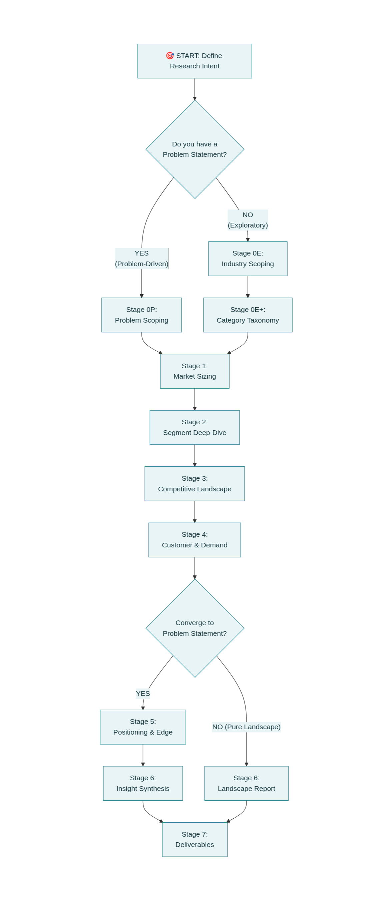
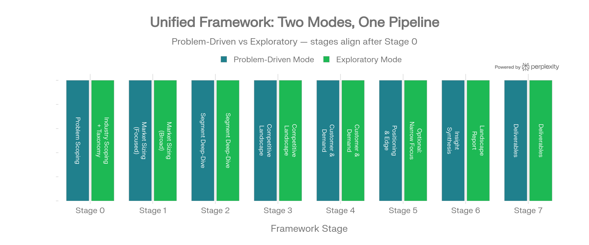

# Unified Dual-Mode Market Research Framework
***
## Framework Architecture: The Mode Switch



The unified framework introduces a **decision gate at the very start** that routes you into one of two entry modes:

| Aspect | 🔍 Exploratory Mode | 🎯 Problem-Driven Mode |
|---|---|---|
| **Starting point** | "I want to understand this industry" | "I have a problem/idea to validate" |
| **Stage 0 goal** | Build category taxonomy + industry map | Define problem statement + hypotheses |
| **Scope** | Broad → progressively narrow | Narrow from the start |
| **Example** | "What does the mental health market look like?" | "Can an AI therapy chatbot compete with BetterHelp?" |
| **Research type** | Exploratory → Descriptive[^1] | Descriptive → Causal[^2] |
| **When to use** | New industry exploration, investment scanning, category entry research | Product validation, competitive positioning, GTM planning |
| **Convergence** | Can optionally narrow to a problem after Stage 4 | Already focused throughout |
---
## Stage 0E: Industry Scoping & Category Taxonomy (Exploratory Mode)
This is the **new stage** that replaces "Problem Discovery" when you don't have a problem statement. Your mental health research is the perfect example of this mode.
### Purpose
Map the entire industry into a structured taxonomy of categories → subcategories → segments before doing any sizing or competitive analysis. This creates the "skeleton" that all subsequent stages fill in with data.[^3][^4]
### Questions to Answer
**Industry Boundary Questions:**
- What is the broadest definition of this industry?
- What adjacent industries overlap (e.g., mental health overlaps with wellness, pharma, HR tech)?
- What are the generally accepted industry classification systems (NAICS, analyst reports, trade associations)?
- What is the value chain — who produces, distributes, delivers, and consumes?[^3]

**Category Identification Questions:**
- What are the major categories within this industry? (e.g., Therapy & Counseling, Digital Therapeutics, Workplace Wellness, Substance Abuse, Child & Adolescent)
- How do industry analysts (Gartner, McKinsey, Deloitte) segment this market?[^5]
- Are categories defined by delivery model, customer type, condition type, or technology?
- Which categories are emerging vs. established vs. declining?

**Segment Mapping Questions (Per Category):**
- What distinct segments exist within each category?
- How are segments differentiated — by modality, price tier, target demographic, geography, technology?[^4]
- Which segments are adjacent (could merge or overlap)?
- What is the logical hierarchy: Industry → Category → Subcategory → Segment → Niche?
### Taxonomy Building Method
Build a **4-level hierarchy** following the Umbrex market mapping methodology:[^3][^4]

```
Level 1: Industry (e.g., Mental Health)
  Level 2: Category (e.g., Digital Therapeutics)
    Level 3: Subcategory (e.g., Mobile-Based CBT)
      Level 4: Segment (e.g., Employer-Sponsored CBT Apps)
```

**Practical steps:**
1. Start with 3-5 analyst reports to identify the most commonly used categories[^6]
2. Cross-reference with trade associations and regulatory classifications
3. Validate with at least 2 sources per category boundary
4. Create a master spreadsheet: one row per segment, columns for category parent, description, key players (initial), estimated size range, growth signal (growing/stable/declining)
### Quantifications at This Stage
- Number of categories identified
- Number of segments per category
- Initial size estimates (order of magnitude: <$1B, $1-10B, $10-50B, $50B+)
- Growth signals per category (qualitative: emerging/growing/mature/declining)
### Frameworks to Apply
- **Market Mapping / Landscape Mapping**: Build the taxonomy structure[^3]
- **Value Chain Analysis**: Understand who creates and captures value[^7]
- **PESTEL** (light pass): What macro forces shape this industry?[^8]
### Deliverable
**Industry Taxonomy Map** — a structured document (spreadsheet + visual) showing all categories, subcategories, and segments with preliminary sizing signals.

***
## Stage 0P: Problem Scoping (Problem-Driven Mode)
This is your original Stage 1 from the previous framework — unchanged but now explicitly labeled as the problem-driven entry point.
### Questions to Answer
(From your validation questions file):[^9]
- **Market Money**: Where is money already being spent? Who is financially incentivized to solve this? What budget line does this come from?
- **User Behavior**: When does the pain occur? What do users try before seeking help? Why do existing solutions fail or get abandoned?
- **Competition**: Who are the "good enough" incumbents? Why do people still complain despite them?
- **AI Advantage**: What human effort is expensive, slow, or inconsistent? What decisions are repetitive but high-impact?
### Deliverable
**Problem Statement Brief** — a 1-2 page document with: problem definition, affected users, current spend, existing solutions, and initial hypotheses.

***
## Stage 1: Market Sizing & Opportunity Assessment (Both Modes)
This is where both tracks converge, but the **scope differs by mode**.
### Mode Differences
| Aspect | Exploratory Mode | Problem-Driven Mode |
|---|---|---|
| **What you size** | Every category and segment in your taxonomy | Your specific target market |
| **Level of detail** | TAM per category, SAM per segment | TAM → SAM → SOM for your specific opportunity |
| **Approach** | Primarily top-down from analyst reports[^10] | Top-down + bottom-up validation[^11][^12] |
| **Output format** | Category × Size matrix with CAGR | Funnel: TAM → SAM → SOM with assumptions |
### Questions to Answer (Both Modes)
- What is the total market value and volume?
- What is the historical and projected CAGR (3-year, 5-year)?
- How is the market distributed across categories/segments?
- What are the growth drivers and headwinds for each segment?
- Which segments are growing fastest? Which are plateauing?
### Exploratory Mode — Additional Questions
- What is the market size for **each** category in the taxonomy?
- What is the market size for **each segment** within each category?
- What is the relative share of each category (pie chart: which category owns what % of total market)?
- Are there segments where reliable data doesn't exist (white spaces)?
### Quantifications
**Exploratory Mode Matrix:**

| Category | Market Size | CAGR | Largest Segment | Segment Size | Segment CAGR |
|---|---|---|---|---|---|
| Therapy & Counseling | $X.XB | X% | Online Therapy | $X.XB | X% |
| Digital Therapeutics | $X.XB | X% | CBT Apps | $X.XB | X% |
| *...per category* | | | | | |

**Problem-Driven Mode Funnel:**
- TAM = Total Potential Customers × Avg Annual Revenue Per Customer[^13]
- SAM = TAM × % Serviceable (geography, product fit, channel)[^14]
- SOM = SAM × Realistic Capture Rate[^15]
### Frameworks
- **TAM-SAM-SOM** (Problem-Driven: full funnel; Exploratory: TAM per category)[^8]
- **Top-Down Sizing** from analyst reports[^10]
- **Bottom-Up Sizing** from unit economics[^11]
### Visualizations
- Market size funnel chart (Problem-Driven)
- Category size treemap or pie chart (Exploratory)
- Growth rate comparison bar chart (CAGR by segment)
- Trend lines showing historical growth[^16]
### Deliverable
- **Exploratory**: Category × Segment sizing matrix with CAGR columns
- **Problem-Driven**: TAM/SAM/SOM model with growth forecast

***
## Stage 2: Segment Deep-Dive (Both Modes)
### Purpose
Go deeper into each segment (Exploratory) or your target segment (Problem-Driven) to understand structure, dynamics, and opportunities.
### Questions to Answer
**For each segment:**
- Who are the top 3-5 players in this segment? What is their estimated market share?
- What is the business model (SaaS, marketplace, service, product)?
- What is the typical pricing range?
- What technology stack or delivery model is dominant?
- What regulatory or compliance requirements exist?
- What is the funding landscape (total VC invested, recent rounds)?[^17]
### Mode Differences
| Aspect | Exploratory Mode | Problem-Driven Mode |
|---|---|---|
| **Coverage** | All segments in taxonomy (lighter depth per segment) | 1-3 target segments (maximum depth) |
| **Player mapping** | Top 3-5 per segment | Full competitive universe |
| **Output** | Segment comparison matrix | Deep segment profile |
### Quantifications
- Market share estimates (%) per segment per player
- Herfindahl-Hirschman Index (HHI) per segment — market concentration
- Average pricing per segment
- Total funding invested per segment
- Number of active players per segment
### Visualizations
- **Bubble chart**: Segments plotted by size (x) × growth (y) × number of players (bubble size)[^18]
- **Heat map**: Segments × key metrics (size, growth, competition intensity, funding)
### Deliverable
**Segment Deep-Dive Matrix** — one row per segment with columns for: size, CAGR, top players, market share distribution, pricing range, business model, funding, regulatory environment.

***
## Stage 3: Competitive Landscape Analysis (Both Modes)
This stage operates identically in both modes — the only difference is **scope** (all segments vs. target segment).
### Questions to Answer
(From your competitive analysis checklist):[^17]
1. What existing technologies and players exist? What is their value proposition?
2. Who are the main users and what pain points are they solving?
3. What is the market share and investor investment per player?
4. What are the customer feedbacks (positive and negative) from forums and reviews?
5. What are the gaps in current offerings?
6. What are the entry barriers? (SWOT + Porter's Five Forces)[^19]
7. What merging technologies could disrupt this landscape?
8. What does the competitive matrix look like?
### Frameworks
- **Porter's Five Forces**: Industry-level structural analysis[^19]
- **SWOT Analysis**: Per-competitor strengths/weaknesses[^8]
- **Strategic Group Mapping**: Cluster competitors by strategy[^3]
- **Competitive Feature Matrix**: Side-by-side comparison[^20][^21]
- **Blue Ocean Strategy Canvas**: Where is uncontested market space?[^8]
### Quantifications
- Feature coverage scores (what % of key features does each player cover?)
- Market share % per player
- Funding totals and recent rounds per player
- Pricing comparison table
- Customer sentiment scores (from review mining)
### Visualizations
- **Porter's Five Forces diagram** (one per segment or industry)[^19]
- **2×2 Positioning matrix** (e.g., price vs. feature breadth)[^22]
- **Spider/Radar chart**: 6-8 KPIs per competitor[^23]
- **Harvey Ball matrix**: Feature comparison grid[^20]
- **Strategic group map**: Bubble chart clustering competitors[^3]
- **Funding timeline**: Bar chart showing investment rounds
### Deliverable
- **Exploratory**: Competitive Landscape Report covering all segments (lighter per segment)
- **Problem-Driven**: Deep Competitive Report + Battle Cards for top 5 competitors[^17]

***
## Stage 4: Customer & Demand Validation (Both Modes)
### Questions to Answer (Both Modes)
- Who are the end users in each segment?
- What are their primary needs, pain points, and jobs-to-be-done?
- What is their buying behavior (how they discover, evaluate, purchase)?
- What signals demand (search trends, forum activity, review volume)?
- What is the willingness to pay?
### Mode Differences
| Aspect | Exploratory Mode | Problem-Driven Mode |
|---|---|---|
| **Customer research** | Segment-level personas | Deep persona + interview-based validation |
| **Demand signals** | Search trends, report data, forum analysis | Landing page tests, pre-orders, Mom Test interviews[^24] |
| **Depth** | Understand the user landscape | Validate specific demand for your solution |
| **Quantifications** | Persona per segment, need-gap mapping | CAC, CLV, NPS, CSAT, CES, conversion rates[^25] |
### Frameworks
- **Jobs-to-be-Done (JTBD)**: Functional + emotional jobs per segment[^8]
- **Value Proposition Canvas**: Pains/Gains/Jobs mapping[^8]
- **Customer Journey Mapping**: Touchpoint analysis[^8]
- **Conjoint Analysis** (Problem-Driven): Willingness-to-pay quantification[^26]
### Deliverable
- **Exploratory**: Customer Landscape Report — one persona per segment, need-gap mapping
- **Problem-Driven**: Customer Validation Report — validated personas, demand evidence, CLV model

***
## 🔀 The Convergence Decision Point
**After Stage 4, exploratory research hits a decision point:**

> "I now understand this industry. Do I want to narrow down to a specific problem/opportunity and continue with positioning & strategy? Or do I want to deliver a pure landscape report?"

**Option A — Converge to Problem-Driven (recommended if you found an opportunity):**
- Write a problem statement based on the gaps you discovered
- Define your target segment(s)
- Continue to Stages 5-7 in Problem-Driven mode

**Option B — Stay Exploratory (pure landscape delivery):**
- Skip Stage 5 (Positioning)
- Go directly to Stage 6 as a Landscape Synthesis
- Deliver an industry report, not a strategy document

This convergence point is what makes the framework truly unified — exploratory research naturally generates the insights that inform a problem statement, which then feeds the problem-driven stages.[^2]

***
## Stage 5: Positioning & Competitive Edge (Problem-Driven Only)
This stage only activates when you have a problem statement — either from Stage 0P or from the convergence point after exploratory research.
### Questions to Answer
(From your checklist):[^17]
- What is our unique competitive advantage?
- What competitive matrix position do we occupy vs. existing players?
- Who is the closest competitor and what is their GTM strategy?
- Will their GTM work for our product? What's the missing customer segment?
- What is the pricing strategy?
- What funding is required? Who are likely investors?
- What is the break-even point?
### Frameworks
- **Blue Ocean ERRC Grid**: Eliminate-Reduce-Raise-Create[^8]
- **Perceptual Positioning Map**: Plot your position vs. competitors[^23]
- **Business Model Canvas**: Full 9-block model[^8]
- **Pricing Analysis**: Competitive pricing + willingness-to-pay alignment
- **Lean Canvas**: One-page business model for rapid testing[^8]
### Quantifications
- USP score (unique feature coverage vs. competitors)
- Share of Voice target
- Break-even volume and timeline
- Funding requirements
- RICE-scored feature priorities[^8]
### Deliverable
**GTM Strategy + Positioning Document** with competitive matrix, pricing model, and funding plan.

***
## Stage 6: Insight Synthesis & Strategic Recommendations (Both Modes)
### Mode Differences
| Aspect | Exploratory Mode (Landscape) | Problem-Driven Mode (Strategy) |
|---|---|---|
| **Synthesis focus** | "Here's what this industry looks like" | "Here's what we should do" |
| **Output** | Opportunity map + investment thesis | Strategic recommendations + action plan |
| **Key visual** | Category attractiveness heat map | Opportunity-risk matrix |
| **Narrative** | Descriptive + analytical | Prescriptive + actionable |
### Both Modes — Common Synthesis Activities
- Cross-reference all findings across stages
- Identify patterns, contradictions, and surprises
- Score categories/segments on attractiveness (size × growth × accessibility × competition intensity)
- Build scenario models: best case / base case / worst case
### Frameworks
- **McKinsey Pyramid Principle**: Lead with the "so what" conclusion[^27]
- **MECE**: Ensure insights are mutually exclusive, collectively exhaustive[^27]
- **GE-McKinsey Matrix**: Score categories on attractiveness × competitive strength[^8]
- **Opportunity-Risk Matrix**: Map opportunities against risks
### Deliverable
- **Exploratory**: Strategic Landscape Report with category rankings and opportunity identification
- **Problem-Driven**: Strategic Recommendations Report with RICE-scored action items

***
## Stage 7: Deliverables, Presentation & Reporting (Both Modes)
### Presentation Structure
Both modes follow the **McKinsey-style 10-slide deck**, but with different content emphasis:[^27]

**Exploratory Mode Deck (10-12 slides):**
1. Title
2. Executive Summary — "The State of [Industry]"
3. Industry Definition & Scope
4. Category Taxonomy (visual map)
5. Market Size by Category (treemap / stacked bar)
6. Segment Deep-Dive: Top 3 categories (1 slide each)
7. Competitive Landscape Overview
8. Customer Needs & Gaps
9. Opportunity Heat Map — Where to play?
10. Next Steps / Recommended Deep-Dives

**Problem-Driven Deck (10-15 slides):**
1. Title
2. Executive Summary — "Why [Solution] Wins"
3. Market Definition
4. Market Size + Growth (TAM/SAM/SOM)
5. Industry Analysis (Porter's Five Forces)
6. Competitive Landscape + Battle Cards
7. Customer Validation Findings
8. Our Positioning + Competitive Edge
9. GTM Strategy + Pricing
10. Financial Model + Funding Ask
11. Risks & Mitigations
12. Next Steps + Timeline
### Report Formats by Audience
| Audience | Exploratory Deliverable | Problem-Driven Deliverable |
|---|---|---|
| **CEO / Board** | Industry Landscape Brief (5 pages) | Strategic Recommendation Deck (15 slides) |
| **Investors** | Market Opportunity Memo | Pitch Deck + Financial Model |
| **Product Team** | Category × Segment Matrix + Gap Analysis | PRD with competitive context + positioning |
| **Sales Team** | Industry overview + player map | Battle Cards + Objection Handlers |
| **Self (Founder)** | Full landscape report (30-40 pages) | Full research report (40-50 pages)[^28] |
### Presentation Best Practices
- One main idea per slide with evidence and implication[^29]
- Use slide titles that tell the story — copy all titles and they should read as an executive summary[^29]
- Mix text and visuals — lean toward USA Today, not New York Times[^30]
- Move technical details to appendices[^31][^30]

***
## Quick-Start Decision Guide
Use this to decide which mode to start in:

**Start in Exploratory Mode (Stage 0E) when:**
- You're entering an industry you don't know well
- You're scanning for investment or entry opportunities
- You want to understand the landscape before committing to an idea
- Someone asks "tell me about the [X] market"
- You're doing industry research for a consulting engagement

**Start in Problem-Driven Mode (Stage 0P) when:**
- You already have a product idea or hypothesis
- You're validating a specific opportunity
- You need to build a pitch deck or business case
- You know your target segment and need competitive depth
- You're preparing for a funding round

**Switch from Exploratory → Problem-Driven when:**
- You've identified a gap in Stage 2-4 that you want to pursue
- A specific segment shows high growth + low competition + unmet needs
- You've found a convergence of market signal + personal interest + capability

***
## Unified Stage Checklist (Copy-Paste Ready)
### Mode Selection
- [ ] Define research intent: Exploratory or Problem-Driven?
- [ ] If unsure, start Exploratory — you can always converge later
### Stage 0E (Exploratory Only)
- [ ] Define industry boundaries
- [ ] Identify 3-5 analyst reports for category structure
- [ ] Build category taxonomy (Industry → Category → Subcategory → Segment)
- [ ] Create master spreadsheet with one row per segment
- [ ] Add preliminary size signals per category (order of magnitude)
### Stage 0P (Problem-Driven Only)
- [ ] Write problem statement (who, what pain, current alternatives, why now)
- [ ] Answer Market Money, User Behavior, Competition, AI Advantage questions[^9]
- [ ] Define target user and target segment
- [ ] List 3-5 hypotheses to validate
### Stage 1: Market Sizing
- [ ] Size each category/segment (Exploratory) or TAM → SAM → SOM (Problem-Driven)
- [ ] Get CAGR for each sized unit
- [ ] Identify growth drivers and headwinds
- [ ] Cross-validate with 2+ sources
- [ ] Create sizing visualization (treemap or funnel)
### Stage 2: Segment Deep-Dive
- [ ] Map top 3-5 players per segment with market share estimates
- [ ] Document business models, pricing, and technology per segment
- [ ] Check funding landscape (Crunchbase, PitchBook)[^20]
- [ ] Calculate HHI for market concentration
- [ ] Build segment comparison matrix
### Stage 3: Competitive Landscape
- [ ] Run Porter's Five Forces analysis[^19]
- [ ] Build competitive feature matrix[^17]
- [ ] Collect customer feedback (positive + negative) from forums[^17]
- [ ] Identify gaps in current offerings
- [ ] Assess entry barriers (SWOT per competitor)
- [ ] Create spider charts for top competitors[^23]
- [ ] Build battle cards (Problem-Driven)
### Stage 4: Customer & Demand
- [ ] Build personas per segment (Exploratory) or deep personas (Problem-Driven)
- [ ] Map

---

## References

1. [Types of Market Research: Exploratory, Descriptive and Causal](https://analythical.com/blog/types-of-market-research) - Exploratory research helps clarify the scope and nature of a business problem or opportunity. As a r...

2. [Descriptive, Exploratory & Causal Research Explained - Rajiv Gopinath](https://www.rajivgopinath.com/blogs/marketing-hub/descriptive-exploratory-causal-research-explained) - Discover the differences between descriptive, exploratory, and causal research methods. This blog pr...

3. [Market Mapping / Landscape Mapping Explained - Umbrex](https://umbrex.com/resources/frameworks/strategy-frameworks/market-mapping-landscape-mapping/) - Market Mapping / Landscape Mapping visualizes players, segments, and value chains to reveal white sp...

4. [Category Segmentation & Taxonomy Design - Umbrex](https://umbrex.com/resources/category-management-handbook/category-segmentation-taxonomy-design/) - Master segmentation and taxonomy design to unlock visibility, analytics, and global‑to‑local categor...

5. [Tech Trends 2026 | Deloitte Insights](https://www.deloitte.com/us/en/insights/topics/technology-management/tech-trends.html) - As technology innovation and adoption accelerate, five trends reveal how successful organizations ar...

6. [3 Steps to Conducting an Effective Market Landscape Analysis](https://www.alpha-sense.com/blog/product/market-landscape-analysis-three-steps/) - Mapping the landscape typically involves three key steps: 1. Identifying the key players within a gi...

7. [Market Landscape Research](https://actionbased.com/market-landscape-research/) - Market Landscape Research is a comprehensive analysis that provides an overview of an industry or ma...

8. [Research-Agent-PRD.docx](https://ppl-ai-file-upload.s3.amazonaws.com/web/direct-files/collection_e3af1106-1de3-435c-9698-af5863d8750d/fdb60729-cd0e-447a-90a9-d67e85e13103/Research-Agent-PRD.docx) - Research Agent --- Product Requirements Document PRD A Role-Based Research Intelligence Platform for...

9. [pasted-text.txt](https://ppl-ai-file-upload.s3.amazonaws.com/web/direct-files/collection_e3af1106-1de3-435c-9698-af5863d8750d/9bc349bf-d92e-4683-943e-e0ac0a0926e0/pasted-text.txt) - High-Level Questions You Should Answer Write These Down Market Money Where is money already being sp...

10. [Market Sizing Research: Step-by-Step Guide](https://dto-research.com/en/services/market-sizing-research) - Mit gezielten B2B-Marktanalysen sichern Sie langfristig den Erfolg Ihres Unternehmens | DTO Research...

11. [Market Sizing: How To Calculate Market Size](https://www.gwi.com/blog/market-sizing) - Learn how to calculate market size with expert tips from GWI. Learn how to expand your brand and cap...

12. [Market Size: How to Segment Demand to Win - Sedulo Group](https://sedulogroup.com/blog-post/market-size/) - Learn how to calculate market size, segment your audience, and target high-value opportunities with ...

13. [TAM SAM SOM: What It Means and How to Calculate | Amazon Ads](https://advertising.amazon.com/library/guides/tam-sam-som) - Steps for calculating TAM SAM SOM

14. [TAM, SAM & SOM: How To Calculate The Size Of Your Market - Antler](https://www.antler.co/blog/tam-sam-som) - It involves estimating the total addressable market (TAM), serviceable addressable market (SAM), and...

15. [Market Sizing with TAM SAM SOM (with calculator) | Seer Interactive](https://www.seerinteractive.com/insights/marketing-sizing-with-tam-sam-som) - Calculate the TAM: Estimate the Total Addressable Market (TAM) by assessing the total demand for the...

16. [8 Data Visualization Best Practices for 2025 - Flow Genius](https://www.flowgenius.ai/post/8-data-visualization-best-practices-for-2025) - For Comparing Categories: Use bar charts (vertical or horizontal). · For Showing Trends Over Time: C...

17. [pasted-text.txt](https://ppl-ai-file-upload.s3.amazonaws.com/web/direct-files/collection_e3af1106-1de3-435c-9698-af5863d8750d/de17f9c7-ee5c-4067-a830-c0aeb4590d60/pasted-text.txt) - Problem Statement Assessment 1. Find the existing technologies, players, what is the value propositi...

18. [Top 10 Proven Data Visualization Best Practices - GoodData](https://www.gooddata.com/blog/5-data-visualization-best-practices/) - 1. Know your audience · 2. Keep your visualizations simple and digestible · 3. Choose the most effec...

19. [Analyzing the Competition With Porter's Five Forces](https://www.businessnewsdaily.com/5446-porters-five-forces.html) - Porter's Five Forces model is a competitive analysis method that's considered a macro tool in busine...

20. [Competitive Analysis for Startups: How to Analyze Competitors ...](https://qubit.capital/blog/competitive-analysis-strategic-positioning) - At its core, competitive analysis involves systematically evaluating the strengths, weaknesses, oppo...

21. [Build Your Startup With Confidence: How To Do A Competitor Analysis](https://www.antler.co/blog/startup-competitor-analysis) - A competitor analysis will help you understand where your rival's strengths and weaknesses lie, sand...

22. [Learn how to prepare and conduct a market mapping process](https://arekskuza.com/the-innovation-blog/market-mapping-and-competitive-landscape/) - Market Mapping is outlining the forces that influence product performance. In this post, I am explai...

23. [Using a Radar Chart as a Perceptual Map -](https://www.perceptualmaps.com/using-a-radar-chart-as-a-perceptual-map/) - A radar chart is a good place to start sorting through the data and is often a better approach than ...

24. [Market Research Validation Guide for Founders | ValidateStrategy](https://validatestrategy.com/idea-validation/market-research-validation-guide) - This guide walks you through every stage of market research validation, from sizing your opportunity...

25. [7 KPIs Your Business Should Be Measuring with Market Research](https://www.driveresearch.com/market-research-company-blog/6-kpis-your-business-should-be-measuring-market-research-syracuse/) - 7 KPIs Your Business Should Be Measuring with Market Research · Common metrics include: · 1. Unaided...

26. [15 of the Best Market Research Tools To Use in 2026 - Quantilope](https://www.quantilope.com/resources/best-market-research-tools) - Comprehensive market research platforms such as quantilope deliver end-to-end research capabilities ...

27. [McKinsey Presentation Structure (A Guide for Consultants)](https://slidemodel.com/mckinsey-presentation-structure/) - This presentation structure is aimed to present the main conclusion upfront, structuring the support...

28. [market-research-reports skill by davila7/claude-code-templates](https://playbooks.com/skills/davila7/claude-code-templates/market-research-reports) - Write each section following the structure guide, ensuring: - **Comprehensive coverage**: Every subs...

29. [Presentation Format Can Make or Break a Market Research Report](https://portma.com/resources/articles/presentation-format-can-make-break-market-research-report/) - Most market research reports are drafted in PowerPoint. It's the easiest tool to present data in a v...

30. [5 Best Practices for Presenting Market Research Results](https://qlarityaccess.com/qlarity/presenting-market-research-results) - 5 Best Practices for Presenting Market Research Results

31. [Market Research Presentation: A Comprehensive Guide - Prezent](https://www.prezent.ai/blog/market-research-presentation-guide) - 1. Market research overview. Define the purpose and objectives of your research. · 2. Methodology. E...

